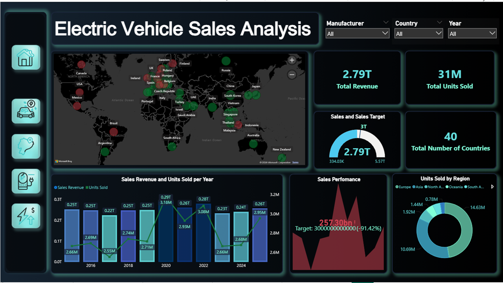

# 🚗 Electric Vehicle Sales Analysis | Excel + Power BI Report

An interactive five-page Power BI report that analyses the electric vehicle (EV) market, covering sales performance, manufacturers, battery technology and pricing. Raw sales data was cleaned and profiled in Excel, loaded through Power Query, and modelled with custom DAX measures.

---

## Project overview

The report is built to answer questions such as:

- How do sales revenue and units sold compare with the target, year by year?
- Which manufacturers, countries and regions lead the market?
- How do vehicles differ by autonomy level and price category?
- How do battery type, charging type and capacity relate to range and energy density?
- How did EV prices change between 2022 and 2025?

---

## Report pages

| Page | Focus | Main visuals |
|---|---|---|
| 1. Sales Performance | Overall sales against target | Sales vs target gauge, sales performance KPI, revenue and units sold per year, sales by country (map), units sold by region |
| 2. Manufacturers and Autonomy | Who sells what | Units sold by manufacturer, units sold per autonomous category, units sold by price category and autonomous category, average safety rating |
| 3. Country and Region | Geographic view and market concentration | Sales revenue by country (treemap), sales by region, number of countries, average sales price, market concentration (HHI) |
| 4. Battery Technology | Battery and charging characteristics | Battery type vs average energy density index, average battery capacity by charging type, average range by battery capacity range, average charging time |
| 5. Price Analysis | Pricing trends | Year vs price (area chart), sales by price category, price analysis 2022-25 (waterfall), model-level table with efficiency, price and safety rating |

Every page has slicers for **Manufacturer**, **Country of Manufacture** and **Year**, plus an icon navigation bar to move between pages.

---

## Key metrics (DAX measures)

Custom measures are kept in a dedicated `_Measures` table:

| Measure | What it shows |
|---|---|
| Sales Target | Target used in the sales vs target gauge and KPI |
| Total Number of Countries | Number of countries in the current selection |
| Average Sales Price | Average sales price of the selected vehicles |
| Average Safety Ratings | Average safety rating of the selected vehicles |
| Average charging time | Average charging time of the selected vehicles |
| Herfindahl-Hirschman Index | Market concentration (sum of squared market shares); higher values mean a few players dominate |

---

## Data

- **Source:** Dataset (CSV) provided as part of a course mini project
- **Table used in the report:** `electric_vehicles_dataset1`
- **Main fields:** Manufacturer, Model, Country_of_Manufacture, Region, Year, Units_Sold_2024, Sales_Revenue, Price_USD, Price_Category, Autonomous Category, Battery_Type, Battery_Capacity_kWh, Energy_Density_Index, Charging_Type, Range_km, Efficiency, Safety_Rating

### Data preparation

- Cleaned and profiled the raw CSV data in Excel: handled missing values and checked the structure of each column
- Loaded the cleaned data into Power BI through Power Query
- Created calculated measures with DAX for the report's key metrics

---

## Key insights

- Large share of the units are sold in Europe, generating a total sales revenue of 1.32 trillion followed by Asia. 
- Herfindahl-Hirschman Index (HHI) is about 254 on a 0 to 10,000 scale. This indicates a very evenly spread market and no single country dominates.
- Battery type changes energy density more than range. Nickel-manganese-cobalt has the highest average energy density index (0.33) and zinc-air the lowest (0.28), while average range stays within 330 to 370 km across all 15 battery types.
- Ferrari has the highest total units (0.85M), about 102% above Li Auto (0.42M), the lowest. Part of the gap is due to model count: Ferrari has 78 vehicle records and Li Auto 47.
- Premium vehicles drive revenue. Each price tier sells about a third of units, but Premium makes 48% of revenue and Entry level only 18%.

---

## How to use this report

1. Download `MINI_PROJECT_REPORT_SREERAG_K_P.pbix` from this repository.
2. Open it in [Power BI Desktop](https://powerbi.microsoft.com/desktop/) (Windows).
3. Use the slicers (Manufacturer, Country of Manufacture, Year) and the navigation icons to explore each page.

---

## Tools used

Excel | Power Query | Power BI | DAX | Data visualization

---

## Author

**Sreerag K P**

- GitHub: [Sreeragkp222](https://github.com/Sreeragkp222)
- LinkedIn: www.linkedin.com/in/sreeragkp222
